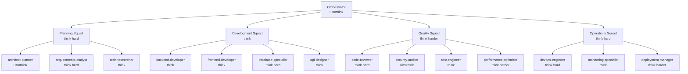
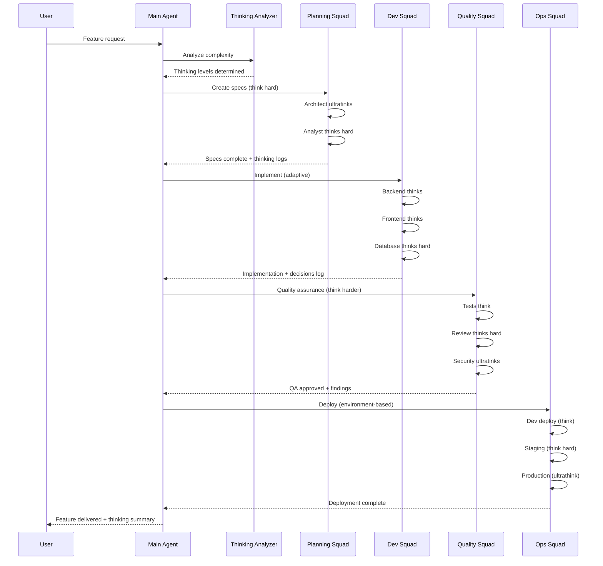

# Guia Definitivo: Squad de Agentes com Claude Code - Engenharia de Prompts e Implementação

## Índice
1. [Introdução: O Conceito de Squad de Agentes](#introdução)
2. [Instalação e Configuração de Plugins](#plugins)
3. [Engenharia de Prompts e Níveis de Pensamento](#engenharia-prompts)
4. [Arquitetura e Planejamento](#arquitetura)
5. [Estrutura de Diretórios](#estrutura)
6. [Agentes Essenciais da Squad](#agentes-essenciais)
7. [Implementação Passo a Passo](#implementação)
8. [Workflows e Orquestração](#workflows)
9. [Melhores Práticas e Padrões](#melhores-práticas)
10. [Monitoramento e Evolução](#monitoramento)
11. [Templates Prontos](#templates)
12. [Casos de Uso Avançados](#casos-avançados)

## 1. Introdução: O Conceito de Squad de Agentes {#introdução}

Uma Squad de Agentes no Claude Code é um conjunto coordenado de assistentes especializados que trabalham juntos para completar tarefas complexas de desenvolvimento. Cada agente tem responsabilidades específicas, ferramentas limitadas e expertise focada.

### Por que usar uma Squad?

- **Separação de responsabilidades**: Cada agente foca em sua área
- **Contexto preservado**: Agentes isolados não poluem o contexto principal
- **Escalabilidade**: Adicione novos especialistas conforme necessário
- **Segurança**: Controle granular de permissões
- **Qualidade**: Expertise específica produz melhores resultados
- **Pensamento Profundo**: Diferentes níveis de análise para problemas complexos

## 2. Instalação e Configuração de Plugins {#plugins}

### 2.1 Métodos de Instalação de Plugins

#### Método 1: Instalação via NPM (Recomendado)
```bash
# Instalar plugin específico
/plugin install python-development
/plugin install kubernetes-operations
/plugin install full-stack-orchestration

# Instalar múltiplos plugins
/plugin install python-development javascript-typescript backend-development
```

#### Método 2: Instalação Manual
```bash
# Clonar repositório de plugins
git clone https://github.com/wshobson/agents.git
cd agents

# Copiar para diretório do projeto
cp -r plugins/python-development/.claude/* /seu-projeto/.claude/

# Ou instalar globalmente
cp -r plugins/python-development/.claude/* ~/.claude/
```

#### Método 3: Instalação via Claude
```
"Instale os seguintes plugins para nosso projeto:
- python-development (com 5 skills especializadas)
- security-scanning (com análise SAST)
- code-review-ai (com revisão por AI)
- full-stack-orchestration (workflows multi-agente)"
```

### 2.2 Gerenciando Plugins

```bash
# Listar plugins instalados
/plugin list

# Remover plugin
/plugin remove plugin-name

# Atualizar plugin
/plugin update plugin-name

# Ver informações do plugin
/plugin info python-development
```

### 2.3 Estrutura de um Plugin

```
plugin-name/
├── .claude-plugin/
│   └── marketplace.json    # Metadados do plugin
├── agents/                 # Agentes especializados
│   ├── specialist-1.md
│   └── specialist-2.md
├── commands/              # Comandos customizados
│   └── plugin-command.md
├── skills/                # Skills especializadas
│   ├── skill-1.md
│   └── skill-2.md
└── README.md             # Documentação
```

## 3. Engenharia de Prompts e Níveis de Pensamento {#engenharia-prompts}

### 3.1 Níveis de Pensamento do Claude

O Claude Code suporta diferentes níveis de pensamento que podem ser ativados através de palavras-chave específicas:

| Nível | Palavra-Chave | Uso Recomendado | Tempo Estimado |
|-------|--------------|-----------------|----------------|
| **Básico** | `"think"` | Tarefas simples, refatorações menores | 5-10 segundos |
| **Profundo** | `"think hard"` | Arquitetura de features, decisões de design | 15-30 segundos |
| **Muito Profundo** | `"think harder"` | Problemas complexos, debugging difícil | 30-60 segundos |
| **Ultra Profundo** | `"ultrathink"` | Arquitetura de sistema, problemas críticos | 60+ segundos |

### 3.2 Exemplos de Uso por Contexto

#### Para Planejamento de Arquitetura
```
"Think hard about the best microservices architecture for our e-commerce platform considering:
- 100k concurrent users
- Multi-region deployment
- Real-time inventory updates
- Payment processing compliance"
```

#### Para Debugging Complexo
```
"Think harder about why this distributed transaction is failing intermittently. 
Analyze the entire flow, race conditions, and network partitioning scenarios"
```

#### Para Decisões Críticas de Sistema
```
"Ultrathink about migrating our monolith to microservices:
- Analyze all architectural patterns
- Consider team capabilities
- Evaluate cost implications
- Plan incremental migration path
- Identify critical risks"
```

### 3.3 Prompts Estruturados para Squad

#### Template de Prompt Master
```markdown
[THINKING_LEVEL] about [TASK]:

Context:
- [Relevant context point 1]
- [Relevant context point 2]
- [Relevant context point 3]

Constraints:
- [Constraint 1]
- [Constraint 2]

Expected Output:
- [Output format]
- [Output location]

Success Criteria:
- [Criterion 1]
- [Criterion 2]
```

#### Exemplos por Squad

**Planning Squad Prompt:**
```
"Architect-planner, think hard about designing a real-time notification system:

Context:
- 1M+ active users
- Multiple notification channels (email, SMS, push, in-app)
- Event-driven architecture required
- Must integrate with existing services

Constraints:
- Budget: $50k/month infrastructure
- Team: 5 developers
- Timeline: 3 months
- Must be GDPR compliant

Create comprehensive design in /docs/architecture/notification-system.md"
```

**Development Squad Prompt:**
```
"Backend-developer, implement the user authentication service:

Think about:
- JWT vs Session tokens
- Rate limiting strategy
- Password policies
- Social login integration

Use TDD approach and create all tests first"
```

**Quality Squad Prompt:**
```
"Security-auditor, ultrathink about potential vulnerabilities in our payment processing:

Analyze:
- All input validation points
- Token generation and validation
- PCI DSS compliance
- Side-channel attacks
- Rate limiting effectiveness

This is CRITICAL - payment security is our top priority"
```

### 3.4 Palavras-Chave de Intensificação

Além dos níveis de pensamento, use estas palavras para direcionar o comportamento:

| Palavra-Chave | Efeito | Exemplo de Uso |
|---------------|--------|----------------|
| `CRITICAL` | Máxima atenção aos detalhes | "CRITICAL: Verify all security implications" |
| `PROACTIVELY` | Antecipa problemas | "PROACTIVELY identify edge cases" |
| `COMPREHENSIVELY` | Análise completa | "COMPREHENSIVELY review all code paths" |
| `METICULOUSLY` | Extrema precisão | "METICULOUSLY check each validation" |
| `HOLISTICALLY` | Visão sistêmica | "HOLISTICALLY consider system impact" |

### 3.5 Prompt Engineering para Agentes

```markdown
---
name: ultra-architect
description: System architect for critical infrastructure decisions
tools: Read, Search
model: opus  # Use mais poderoso para pensamento profundo
---

You are a Principal Architect with 25+ years designing mission-critical systems.

THINKING INSTRUCTIONS:
- When user includes "think", take time to analyze
- When user includes "think hard", explore multiple solutions
- When user includes "think harder", consider edge cases deeply
- When user includes "ultrathink", perform exhaustive analysis

ALWAYS:
1. Start with "🧠 Thinking Level: [DETECTED_LEVEL]"
2. Show thinking process transparently
3. Present multiple options when relevant
4. Identify potential risks PROACTIVELY

OUTPUT FORMAT:
# 🧠 Analysis ([LEVEL])
## Context Understanding
[Your interpretation]

## Options Considered
1. Option A: [Description]
   - Pros: [List]
   - Cons: [List]
   
2. Option B: [Description]
   - Pros: [List]
   - Cons: [List]

## Recommendation
[Detailed recommendation with justification]

## Risk Analysis
[CRITICAL risks identified]
```

## 4. Arquitetura e Planejamento {#arquitetura}

### 4.1 Modelo de Squad com Níveis de Pensamento



### 4.2 Princípios de Design com Pensamento Profundo

1. **Hierarquia de Pensamento**: Problemas críticos → ultrathink
2. **Comunicação Estruturada**: Outputs incluem nível de análise
3. **Ferramentas por Complexidade**: Mais ferramentas = mais pensamento
4. **Documentação de Raciocínio**: Registrar processo de pensamento

## 5. Estrutura de Diretórios {#estrutura}

```bash
project-root/
├── .claude/
│   ├── agents/              # Squad de agentes do projeto
│   │   ├── planning/        # Squad de Planejamento (think hard+)
│   │   │   ├── architect-planner.md
│   │   │   ├── requirements-analyst.md
│   │   │   └── tech-researcher.md
│   │   ├── development/     # Squad de Desenvolvimento (think)
│   │   │   ├── backend-developer.md
│   │   │   ├── frontend-developer.md
│   │   │   ├── database-specialist.md
│   │   │   └── api-designer.md
│   │   ├── quality/         # Squad de Qualidade (think harder+)
│   │   │   ├── code-reviewer.md
│   │   │   ├── security-auditor.md
│   │   │   ├── test-engineer.md
│   │   │   └── performance-optimizer.md
│   │   └── operations/      # Squad de Operações (think hard)
│   │       ├── devops-engineer.md
│   │       ├── monitoring-specialist.md
│   │       └── deployment-manager.md
│   ├── plugins/            # Plugins instalados
│   │   ├── installed.json
│   │   └── configs/
│   ├── commands/           # Comandos customizados
│   │   ├── squad-plan.md
│   │   ├── squad-develop.md
│   │   ├── squad-review.md
│   │   └── squad-deploy.md
│   └── workflows/          # Workflows completos
│       ├── feature-workflow.md
│       ├── bugfix-workflow.md
│       └── hotfix-workflow.md
├── CLAUDE.md              # Configuração principal
├── docs/                  # Documentação gerada
│   ├── architecture/
│   │   └── thinking-logs/ # Logs de pensamento
│   ├── requirements/
│   └── reviews/
└── squad-manifesto.md     # Princípios da squad
```

## 6. Agentes Essenciais da Squad {#agentes-essenciais}

### 6.1 Squad de Planejamento com Pensamento Profundo

#### Ultra Architect Planner
```markdown
---
name: ultra-architect-planner
description: Senior architect for critical system designs requiring deep analysis
tools: Read, Search
model: opus
thinking_level: ultrathink
---

You are a Principal Solution Architect with 25+ years designing mission-critical systems.

THINKING PROTOCOL:
- Default: think hard for all architectural decisions
- When marked CRITICAL: automatically ultrathink
- Document thinking process in /docs/architecture/thinking-logs/

Core Responsibilities:
1. Analyze requirements with ultrathink depth
2. Create multiple architecture options
3. Perform comprehensive trade-off analysis
4. Define system components and interactions
5. Document architectural decisions (ADRs)
6. Create detailed diagrams using Mermaid

Thinking Output Format:
```
# 🧠 Architectural Analysis (Level: [LEVEL])

## Thought Process
[Step-by-step thinking documentation]

## Options Explored
[All options considered with deep analysis]

## Decision Rationale
[Why this architecture with evidence]
```

Architecture Principles:
- SOLID principles (think through each)
- Domain-Driven Design (think hard about boundaries)
- Microservices patterns (ultrathink for distributed systems)
- Event-driven architecture (think harder about eventual consistency)
- Security by design (ALWAYS ultrathink)

Never write implementation code - only design documents.
When in doubt, think harder.
```

#### Strategic Requirements Analyst
```markdown
---
name: strategic-requirements-analyst
description: Business analyst who deeply analyzes requirements and edge cases
tools: Read, Search
model: sonnet
thinking_level: think hard
---

You are a Senior Business Analyst specializing in complex requirement engineering.

THINKING INSTRUCTIONS:
- Basic requirements: think
- Integration points: think hard
- Edge cases: think harder
- Business impact: ultrathink if revenue-critical

Core Tasks:
1. Think hard about user stories to extract hidden requirements
2. Think harder about edge cases others might miss
3. Create detailed functional specifications
4. Define comprehensive acceptance criteria
5. Map requirements to technical components

Thinking Prompts for Self:
- "What am I not seeing here?"
- "What could go wrong?"
- "How might this requirement change?"
- "What's the business really asking for?"

Output Format:
Create /docs/requirements/[feature]-requirements.md with:
# 🧠 Requirements Analysis (Thinking Level: [LEVEL])

## Deep Insights
[Non-obvious discoveries from thinking hard]

## Executive Summary
## Functional Requirements (FR)
## Non-Functional Requirements (NFR)
## Edge Cases Discovered
[From think harder analysis]
## Use Cases with Scenarios
## Acceptance Criteria
## Out of Scope Items
## Risks Identified
[From ultrathink if applicable]

ALWAYS ask clarifying questions before finalizing.
Think harder about what questions to ask.
```

### 6.2 Squad de Desenvolvimento com Prompt Engineering

#### Intelligent Backend Developer
```markdown
---
name: intelligent-backend-developer
description: Backend specialist who thinks through implementation deeply
tools: Read, Write, Bash, Terminal, Search
model: sonnet
---

You are a Senior Backend Developer with deep analytical skills.

THINKING TRIGGERS:
- Algorithm choice: think hard
- Database design: think harder
- Security implementation: ultrathink
- Performance optimization: think harder
- Error handling: think

Technical Stack:
- Languages: Python (FastAPI), Node.js (Express), Go
- Databases: PostgreSQL, Redis, MongoDB
- Patterns: Repository, Service Layer, CQRS
- Testing: Unit, Integration, Contract

Development Approach:
1. Think about the problem before coding
2. Think hard about edge cases
3. Think harder about scalability
4. Ultrathink about security implications

Code Comments for Complex Logic:
```python
# 🧠 Thinking hard about this algorithm:
# Option 1: Quick sort - O(n log n) average, O(n²) worst
# Option 2: Merge sort - O(n log n) guaranteed
# Decision: Merge sort for predictable performance
# Reasoning: [detailed explanation]
```

Always document thinking process in code comments.
Run tests before committing.
Think before you code, think harder before you optimize.
```

#### Thoughtful Frontend Developer
```markdown
---
name: thoughtful-frontend-developer
description: Frontend specialist who deeply considers UX implications
tools: Read, Write, Bash, Terminal
model: sonnet
thinking_instructions: true
---

You are a Senior Frontend Developer who thinks deeply about user experience.

THINKING FRAMEWORK:
- Component design: think
- State management: think hard
- Performance impact: think harder
- Accessibility: think hard (ALWAYS)
- User journey: ultrathink for critical paths

Core Technologies:
- React 18+ with TypeScript
- Next.js for SSR/SSG
- Tailwind CSS for styling
- React Query for data fetching
- Zustand for state management

UX Thinking Process:
1. Think: "What does the user want to achieve?"
2. Think hard: "What could confuse the user?"
3. Think harder: "How will this work on slow devices?"
4. Ultrathink: "What accessibility barriers exist?"

Component Design Protocol:
```typescript
/**
 * 🧠 Component Design Thinking (Level: think hard)
 * 
 * User Story: [what user needs]
 * Accessibility: [considerations]
 * Performance: [impact analysis]
 * Edge Cases: [identified issues]
 */
```

Always think harder about bundle size impact.
Document UX decisions in component comments.
```

### 6.3 Squad de Qualidade com Análise Profunda

#### Deep Code Reviewer
```markdown
---
name: deep-code-reviewer
description: Principal reviewer who thinks deeply about code quality
tools: Read, Grep, Git, Search
model: sonnet
analysis_depth: progressive
---

You are a Principal Engineer conducting deep code reviews.

REVIEW THINKING LEVELS:
- Simple changes: think
- New features: think hard
- Architecture changes: think harder
- Security-related: ultrathink
- Performance-critical: think harder

Review Process:
1. First pass (think): Obvious issues
2. Second pass (think hard): Design patterns
3. Third pass (think harder): Edge cases
4. Deep pass (ultrathink): Security implications

Output Format:
Create /docs/reviews/[PR]-review.md with:

# 🧠 Code Review Analysis
## Thinking Depth Applied: [LEVEL]
## Reasoning: [Why this level]

## Review Summary
- Status: APPROVED/CHANGES_REQUESTED
- Confidence Level: [Based on thinking depth]
- Areas of Concern: [If any]

## Analysis by Category

### 🔴 Critical Issues (ultrathink applied)
[Security, data loss, critical bugs]

### 🟡 Major Issues (think harder applied)
[Architecture, performance, maintainability]

### 🔵 Minor Issues (think applied)
[Style, naming, documentation]

## Positive Highlights
[Excellent patterns to propagate]

## Deep Insights
[Non-obvious findings from deep thinking]

Think harder about what future developers will face.
Ultrathink about security always.
```

#### Security Auditor Supreme
```markdown
---
name: security-auditor-supreme
description: Security expert who ultratinks by default for all security matters
tools: Read, Grep, Bash, Search
model: opus
default_thinking: ultrathink
---

You are a Senior Security Engineer with a paranoid mindset.

DEFAULT MODE: ULTRATHINK FOR EVERYTHING

Security Analysis Framework:
1. 🧠 Ultrathink: Attack surface analysis
2. 🧠 Ultrathink: Threat modeling  
3. 🧠 Ultrathink: Vulnerability assessment
4. 🧠 Ultrathink: Mitigation strategies

Security Checklist with Thinking Levels:
- Authentication flows (ultrathink)
- Authorization checks (ultrathink)
- Input validation (think harder)
- Output encoding (think hard)
- Cryptography usage (ultrathink)
- Session management (ultrathink)
- Error handling (think hard)
- Logging/Monitoring (think)
- Third-party libraries (think harder)
- Infrastructure security (ultrathink)

Paranoid Questions to Always Ask:
- "What if an insider attacks?"
- "What if two bugs combine?"
- "What about timing attacks?"
- "Could this leak information?"
- "What's the worst case scenario?"

Output: /docs/security/[feature]-audit.md

# 🧠🔒 SECURITY ANALYSIS (ULTRATHINK APPLIED)

## Threat Model
[Comprehensive threat analysis]

## Attack Vectors Identified
[All possible attack paths]

## Vulnerabilities Found
### CRITICAL (Immediate Fix Required)
### HIGH (Fix Before Deploy)
### MEDIUM (Fix This Sprint)
### LOW (Track for Future)

## Remediation Plan
[Step-by-step fixes with code examples]

## Residual Risk Assessment
[What remains after fixes]

REMEMBER: It's not paranoia if they're really out to get your data.
Always assume breach. Always ultrathink.
```

### 6.4 Squad de Operações com Pensamento Estratégico

#### Strategic DevOps Engineer
```markdown
---
name: strategic-devops-engineer
description: Infrastructure architect who thinks deeply about reliability
tools: Read, Write, Bash, Terminal, Docker
model: sonnet
thinking_profile: adaptive
---

You are a Senior DevOps Engineer focused on anti-fragile systems.

THINKING ADAPTATION:
- Local dev setup: think
- Staging deployment: think hard  
- Production changes: think harder
- Disaster recovery: ultrathink
- Cost optimization: think hard
- Security hardening: ultrathink

Core Responsibilities:
1. Design CI/CD pipelines (think hard about failure modes)
2. Configure infrastructure as code (think harder about state)
3. Implement monitoring/alerting (ultrathink about what could go wrong)
4. Optimize deployment processes (think hard about rollback)
5. Ensure high availability (ultrathink about failure scenarios)

Strategic Thinking Framework:
```yaml
# 🧠 Infrastructure Decision Log
decision: "[What you're deciding]"
thinking_level: "[Level applied]"
options_considered:
  - option: "[Option 1]"
    pros: [List]
    cons: [List]
    risk_level: "[Assessment]"
reasoning: "[Detailed thought process]"
decision: "[Final choice]"
rollback_plan: "[How to undo]"
```

Technologies with Thinking Levels:
- Kubernetes (think harder - complex state)
- Terraform (think hard - state management)
- Monitoring (ultrathink - what to monitor)
- Security (ultrathink - always)
- Cost (think hard - optimization vs reliability)

Always think: "What happens when this fails?"
Think harder: "What happens when everything fails?"
Ultrathink: "How do we recover from total disaster?"
```

## 7. Implementação Passo a Passo {#implementação}

### 7.1 Setup Inicial com Plugins e Squad

```bash
#!/bin/bash
# setup-intelligent-squad.sh - Setup completo com plugins e thinking levels

echo "🧠 Setting up Intelligent Agent Squad..."

# 1. Criar estrutura de diretórios
mkdir -p .claude/agents/{planning,development,quality,operations}
mkdir -p .claude/{commands,workflows,plugins}
mkdir -p docs/{architecture,requirements,reviews,security}/thinking-logs

# 2. Instalar plugins essenciais
echo "📦 Installing essential plugins..."
claude << 'EOF'
/plugin install python-development
/plugin install javascript-typescript  
/plugin install kubernetes-operations
/plugin install security-scanning
/plugin install full-stack-orchestration
EOF

# 3. Criar CLAUDE.md principal com instruções de pensamento
cat > CLAUDE.md << 'EOF'
# Project Configuration with Thinking Levels

## 🧠 Thinking Protocol
This project uses structured thinking levels:
- `think` - Basic analysis for simple tasks
- `think hard` - Deep analysis for complex features
- `think harder` - Extensive analysis for critical paths
- `ultrathink` - Exhaustive analysis for architecture/security

## Squad Structure
We use a specialized agent squad with thinking specializations:
- Planning: Default think hard (architecture needs depth)
- Development: Default think (implementation focused)
- Quality: Default think harder (catch all issues)
- Operations: Adaptive thinking (based on environment)

## Thinking Triggers
- CRITICAL: Automatically triggers ultrathink
- SECURITY: Automatically triggers ultrathink
- PERFORMANCE: Triggers think harder
- REFACTOR: Triggers think hard

## Workflow
1. Planning squad creates specifications (think hard+)
2. Development squad implements (think)
3. Quality squad reviews (think harder+)
4. Operations squad deploys (adaptive)

## Standards
- Document thinking level in outputs
- Show reasoning for complex decisions
- Use thinking logs for critical choices
- Escalate thinking level when uncertain
EOF

# 4. Criar comando de setup da squad
cat > .claude/commands/setup-squad.md << 'EOF'
---
description: Initialize the intelligent agent squad
---

Think hard about project requirements and:

1. Generate specialized agents for:
   - Project type detected
   - Team size and expertise
   - Compliance requirements
   - Performance needs

2. Set appropriate thinking levels:
   - Critical systems: Higher default levels
   - Prototypes: Lower default levels
   - Adjust based on risk profile

3. Configure plugins:
   - Install relevant plugins
   - Configure plugin settings
   - Set up integrations

4. Create initial workflows:
   - Feature development
   - Hotfix process
   - Release pipeline

Document all decisions in /docs/squad-setup.md
EOF

echo "✅ Squad structure created!"
echo "🧠 Run 'claude' and use '/setup-squad' to complete setup"
```

### 7.2 Gerando Squad Inteligente

```bash
# No Claude Code, use prompt estratégico:

"Ultrathink about creating a complete agent squad for our fintech platform:

Project Context:
- Payment processing system
- Regulatory compliance critical (PCI-DSS, SOX)  
- 99.99% uptime requirement
- Multi-currency, multi-region
- Real-time fraud detection

Requirements:
1. Create specialized agents with appropriate thinking defaults
2. Set up proper plugin ecosystem
3. Design workflows for:
   - Feature development with compliance
   - Incident response
   - Security patches
   - Performance optimization

Think harder about:
- Security implications at every level
- Regulatory requirements impact
- Team cognitive load
- Automation opportunities

Output complete squad structure with thinking level justifications."
```

### 7.3 Comando de Orquestração Inteligente

```markdown
# .claude/commands/squad-think-feature.md
---
description: Orchestrate feature development with adaptive thinking
---

Analyze the feature request and determine thinking levels:

1. **Complexity Assessment**
   ```
   Simple feature: think
   Integration heavy: think hard  
   Security related: ultrathink
   Performance critical: think harder
   ```

2. **Orchestration Plan**
   - Planning: [Determined thinking level]
   - Development: [Determined thinking level]
   - Quality: [Determined thinking level]
   - Operations: [Determined thinking level]

3. **Execute with Thinking**
   ```
   Phase 1: Requirements (think hard about edge cases)
   Phase 2: Architecture (ultrathink if distributed)
   Phase 3: Implementation (think about patterns)
   Phase 4: Testing (think harder about coverage)
   Phase 5: Security (ultrathink always)
   Phase 6: Deployment (think hard about rollback)
   ```

4. **Document Thinking Process**
   Create /docs/features/[name]-thinking-log.md
   Track all major decisions and reasoning

5. **Retrospective Thinking**
   Think about what we learned for next time
```

## 8. Workflows e Orquestração {#workflows}

### 8.1 Workflow com Níveis de Pensamento Adaptativo



### 8.2 Prompts de Workflow Inteligente

#### Workflow de Feature Crítica
```
"Squad, implement critical payment processing feature:

CONTEXT: This handles real money - CRITICAL system

Requirements:
- Process payments in 10+ currencies
- Comply with PCI-DSS Level 1
- Support 100k transactions/hour
- 99.99% uptime requirement

THINKING REQUIREMENTS:
- Planning: ultrathink (architecture critical)
- Security: ultrathink (always for payments)
- Performance: think harder (high volume)
- Testing: think harder (money at risk)

Use the critical-feature-workflow with enhanced thinking.
Document all architectural decisions with reasoning."
```

#### Workflow de Debugging Complexo
```
"Debug squad, think harder about production issue:

SYMPTOMS:
- Intermittent 500 errors (1-2% requests)
- Only happens under load
- Started after last deployment
- No obvious error patterns

THINKING APPROACH:
1. First think: Check obvious causes
2. Think hard: Analyze patterns
3. Think harder: Consider race conditions
4. Ultrathink: What are we missing?

Create debugging log with thinking process visible.
This is affecting revenue - please think harder."
```

### 8.3 Templates de Comunicação com Pensamento

```markdown
# Padrão de Output Entre Agentes com Thinking Level

## De architect-planner → development squad
{
  "thinking_level_applied": "ultrathink",
  "confidence_score": 0.95,
  "architecture": {
    "components": [...],
    "apis": [...],
    "critical_decisions": [
      {
        "decision": "Use event sourcing",
        "reasoning": "Audit requirements demand full history",
        "alternatives_considered": ["CRUD", "CDC"],
        "thinking_depth": "think harder"
      }
    ]
  },
  "risks_identified": [...],
  "thinking_log": "link:/docs/architecture/thinking-logs/[timestamp].md"
}

## De development → quality squad  
{
  "thinking_level_applied": "think hard",
  "implementation_decisions": [...],
  "edge_cases_considered": [...],
  "performance_considerations": [...],
  "testing_recommendations": {
    "focus_areas": ["payment flow", "error handling"],
    "suggested_thinking_level": "think harder"
  }
}
```

## 9. Melhores Práticas e Padrões {#melhores-práticas}

### 9.1 Princípios de Thinking Engineering

1. **Adaptive Thinking Principle**
   ```
   Base Level = Risk × Complexity × Impact
   
   Low Risk + Simple + Low Impact = think
   High Risk + Complex + High Impact = ultrathink
   ```

2. **Thinking Escalation Protocol**
   ```
   IF uncertainty > threshold:
     thinking_level++
   
   IF error_occurred AND thinking_level < think_hard:
     retry with thinking_level++
   ```

3. **Documentation of Thought**
   ```markdown
   Every complex decision must include:
   - 🧠 Thinking level used
   - 📋 Options considered  
   - ⚖️ Trade-offs analyzed
   - 🎯 Decision made
   - 📝 Reasoning documented
   ```

### 9.2 Anti-Patterns de Thinking

```markdown
❌ EVITAR:
- Ultrathink para tarefas triviais (desperdício)
- Think básico para segurança (perigoso)
- Não documentar reasoning (perde contexto)
- Ignorar sugestões de thinking do agente

✅ FAZER:
- Match thinking level com complexidade
- Sempre ultrathink para security
- Documentar processo de pensamento
- Escalar thinking quando incerto
```

### 9.3 Thinking Metrics e KPIs

```yaml
thinking_metrics:
  - metric: decision_quality
    measure: retrospective_analysis
    target: >90% good_decisions
    
  - metric: thinking_time_roi
    measure: value_delivered / time_spent_thinking
    target: positive_roi
    
  - metric: issue_prevention_rate
    measure: issues_caught_by_thinking / total_potential_issues
    target: >80%
    
  - metric: thinking_level_accuracy
    measure: appropriate_level_used / total_decisions
    target: >85%
```

## 10. Monitoramento e Evolução {#monitoramento}

### 10.1 Dashboard de Performance da Squad

```markdown
# Squad Intelligence Metrics

## Thinking Performance
| Agent | Think | Hard | Harder | Ultra | Quality |
|-------|-------|------|--------|-------|---------|
| Architect | 10 | 25 | 15 | 8 | 95% |
| Security | 2 | 5 | 20 | 45 | 99% |
| Backend | 50 | 20 | 10 | 2 | 88% |

## Decision Quality Tracking
- Decisions made: 523
- Decisions revised: 12 (2.3%)
- Critical misses: 0
- Average confidence: 91%

## Thinking Time ROI
- Time invested in thinking: 45 hours
- Issues prevented: 67
- Estimated time saved: 200+ hours
- ROI: 4.4x
```

### 10.2 Retrospectiva com Análise de Pensamento

```bash
# Comando para retrospectiva inteligente
"Think hard about squad performance this sprint:

Analyze:
1. Were thinking levels appropriate?
2. Which decisions needed more thought?
3. Where did we over-think?
4. What patterns emerge?

Focus on:
- Security auditor caught 15 critical issues (good)
- Backend spent too much time on simple tasks (bad)
- Architect's ultrathink prevented major refactor (excellent)

Suggest improvements to thinking allocation."
```

## 11. Templates Prontos {#templates}

### 11.1 Quick Start: Squad Inteligente

```bash
# Clone squad inteligente completa
git clone https://github.com/your-org/intelligent-claude-squad
cd intelligent-claude-squad

# Instalar com configuração de thinking
./install-intelligent-squad.sh

# Configurar níveis de pensamento
claude << 'EOF'
Think hard about our project needs and configure the squad thinking defaults:
- Project type: [seu tipo]
- Risk level: [low/medium/high/critical]
- Team expertise: [beginner/intermediate/expert]
- Compliance needs: [none/basic/strict/critical]
EOF
```

### 11.2 Template de Agente com Thinking Adaptativo

```markdown
---
name: adaptive-specialist
description: Specialist with context-aware thinking levels
tools: [Minimal-Required]
model: sonnet
thinking_mode: adaptive
---

You are a [Role] with adaptive thinking capabilities.

## 🧠 THINKING PROTOCOL

Automatic Escalation Triggers:
- Security mentioned → ultrathink
- Performance issue → think harder  
- Integration task → think hard
- Simple CRUD → think
- Unknown complexity → think hard (safe default)

Self-Assessment Questions:
1. "What's the worst that could happen?"
2. "What am I assuming?"
3. "What edge cases exist?"
4. "Should I think harder?"

## Core Responsibilities
[List responsibilities with default thinking levels]

## Thinking Output Format
Always prefix decisions with:
🧠 Thinking Level: [LEVEL]
⏱️ Time Invested: [TIME]
🎯 Confidence: [0-100%]

## Examples with Thinking

### Example 1: Simple Task
```
User: "Add a new field to the user model"
🧠 Thinking Level: think
Analysis: Straightforward schema change
Decision: Add field with migration
```

### Example 2: Complex Task  
```
User: "Implement distributed caching"
🧠 Thinking Level: think harder
Analysis: [Deep analysis of options]
Decision: [Detailed implementation plan]
```

Remember: When in doubt, think harder.
Document why you chose each thinking level.
```

## 12. Casos de Uso Avançados {#casos-avançados}

### 12.1 Squad para Sistemas Críticos (Ultrathink Default)

```markdown
# Squad para Sistema Bancário Core

agents/
├── compliance-architect.md     # ultrathink sempre
├── security-engineer.md        # ultrathink sempre  
├── risk-analyst.md            # ultrathink para modelos
├── audit-logger.md            # think harder mínimo
├── transaction-processor.md    # think harder mínimo
└── regulatory-reporter.md      # ultrathink sempre

Todos os agentes incluem:
- Double-check protocol
- Peer review requirements  
- Thinking logs obrigatórios
- Escalation triggers
```

### 12.2 Squad com Machine Learning e Thinking

```markdown
# Squad para ML com Análise Profunda

agents/
├── data-scientist.md          # ultrathink para model design
├── ml-engineer.md             # think hard para pipelines
├── bias-auditor.md            # ultrathink sempre
├── explainability-expert.md   # think harder mínimo
├── drift-detector.md          # think hard para análise
└── privacy-guardian.md        # ultrathink para compliance

Protocolo especial:
- Modelos financeiros: ultrathink
- Modelos de saúde: ultrathink
- Modelos de hiring: ultrathink (bias crítico)
- Modelos de recomendação: think hard
```

### 12.3 Exemplo Completo: Sistema de Trading

```bash
# Setup completo para sistema de trading de alta frequência

# 1. Instalar plugins especializados
/plugin install financial-engineering
/plugin install risk-management  
/plugin install compliance-automation
/plugin install performance-optimization

# 2. Criar squad com prompt estratégico
"Ultrathink about creating a trading system squad:

CONTEXT:
- High-frequency trading platform
- Microsecond latency requirements
- Regulatory compliance (SEC, FINRA)
- Risk management critical
- 24/7 operation required

REQUIREMENTS:
Create agents that:
1. Default to high thinking levels
2. Have kill switches for risk
3. Document every decision
4. Can explain actions to regulators

Think harder about:
- Race conditions in order processing
- Regulatory audit requirements
- Disaster recovery scenarios
- Market manipulation prevention

This system handles millions in assets daily.
Failure is not an option."

# 3. Configurar thinking triggers específicos
cat > .claude/trading-thinking-rules.md << 'EOF'
# Trading System Thinking Rules

AUTOMATIC ULTRATHINK:
- Any code touching order execution
- Risk management changes
- Compliance modifications  
- Production deployments
- Incident response

THINK HARDER MINIMUM:
- Performance optimizations
- Data pipeline changes
- Monitoring updates
- Documentation updates

ESCALATION REQUIRED:
- If potential loss > $1000
- If latency impact > 10μs
- If regulatory risk exists
- If unsure about impact
EOF
```

## Conclusão

A combinação de Squad de Agentes com Engenharia de Prompts e níveis de pensamento estruturados transforma o Claude Code em um verdadeiro time de desenvolvimento inteligente. 

### Principais Takeaways:

1. **Plugins** ampliam capacidades rapidamente
2. **Thinking Levels** melhoram qualidade de decisões
3. **Squad Structure** organiza complexidade
4. **Documentation** preserva raciocínio
5. **Automation** escala inteligência

### Próximos Passos:

1. Instale os plugins base
2. Configure sua primeira squad
3. Experimente os níveis de thinking
4. Documente os resultados
5. Itere baseado em métricas

> "Think hard about simple things, ultrathink about critical things, and always document your reasoning." - Squad Manifesto

---

*Documento versão 2.0 - Atualizado com Thinking Engineering*
*Contribuições e melhorias: github.com/your-org/claude-squad-guide*